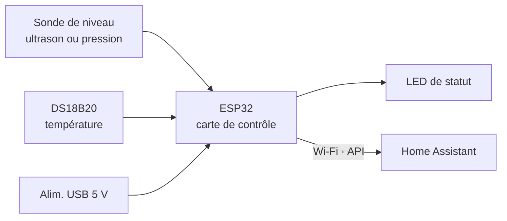

# Limnimètre pour cuve de récupération d'eau de pluie

Mesure du niveau d'eau d'une cuve de récupération, transmission sans fil et
intégration à Home Assistant.

Projet EI Deeptech « Développement de produits », Centrale Lille, 2026.
Cahier des charges **SRS00004**.

---

## Le besoin

De plus en plus de foyers s'équipent de cuves de récupération d'eau de pluie,
mais peu de solutions permettent d'en connaître le remplissage. L'appareil
mesure la hauteur d'eau restante et la publie dans une instance domotique.

Les deux approches imposées par le sujet sont évaluées :

| Approche | Capteur | Rôle |
| --- | --- | --- |
| Sans contact | DFRobot SEN0311 (A02YYUW), ultrason étanche, UART | Voie principale |
| Avec contact | DFRobot KIT0139, sonde immergée 4–20 mA, 0–5 m | Voie de redondance |
| Compensation | DS18B20 étanche, 1-Wire | Vitesse du son |

Une troisième piste, le tube immergé avec capteur de pression différentiel,
a été évaluée sur dossier puis écartée.

---

## La cuve cible

Cylindre vertical de **10 m³**, **2 m de diamètre**, soit environ **3,18 m**
de hauteur d'eau.

Conséquences de dimensionnement :

- 1 cm de hauteur vaut **31,4 litres**. 2 cm en valent 63.
- Ignorer la température fausse la mesure ultrason d'environ **11 cm** pour
  20 °C d'écart sur 3,2 m. La compensation n'est pas optionnelle.
- Les 2 cm exigés par REQ006 représentent 0,6 % de la pleine échelle.

---

## Architecture



Une seule carte contrôle tout : l'ESP32-DevKitC. Le firmware est écrit en
ESPHome, ce qui donne la découverte automatique dans Home Assistant et les
mises à jour par Wi-Fi.

La chaîne de calcul, du capteur à l'affichage :

```
distance brute → correction de température → filtre médian
  → rejet des aberrations → hauteur → volume et pourcentage
```

Formules implémentées :

```
h = H − d          avec d = c(T) × t / 2
c(T) ≈ 331,3 + 0,606 × T      (m/s)
V = π r² h                     (3 142 L par mètre pour r = 1 m)
```

---

## Contenu du dépôt

```
limnimetre.yaml                 firmware ESPHome
secrets.yaml                    identifiants Wi-Fi et clés (non versionné)
home-assistant/
  limnimetre_simulation.yaml    entités simulées, pour travailler sans capteur
  dashboard-limnimetre.yaml     tableau de bord
DEMARRAGE.md                    installation pas à pas
```

---

## Mise en route

Les étapes détaillées sont dans `DEMARRAGE.md`. En résumé :

```bash
# Home Assistant
docker run -d --name homeassistant --restart=unless-stopped \
  -v ~/limnimetre/ha-config:/config -p 8123:8123 \
  ghcr.io/home-assistant/home-assistant:stable

# ESPHome
docker run -d --name esphome --restart=unless-stopped \
  -v ~/limnimetre:/config -p 6052:6052 \
  ghcr.io/esphome/esphome:stable
```

Puis http://localhost:8123 et http://localhost:6052.

### Mode simulation

Le firmware tourne **sans aucun capteur**. Un réglage « Niveau simulé »
dans Home Assistant remplace la mesure, et toute la chaîne de calcul
fonctionne à l'identique. Cela permet de développer et de tester le tableau
de bord, les alertes et les automatisations avant la livraison du matériel.

Le jour du flash, il suffit de supprimer le bloc `number:` et les deux
capteurs simulés de `limnimetre.yaml`, puis de décommenter la section
« CAPTEURS REELS ». Rien d'autre ne bouge.

---

## Exigences et traçabilité

| Exigence | Réponse technique | État |
| --- | --- | --- |
| REQ001 — mesurer le niveau | SEN0311 et KIT0139, les deux voies | Simulé |
| REQ002 — transmission régulière | Publication toutes les 60 s | Simulé |
| REQ003 — disponibilité au démarrage | Découverte automatique + état indisponible | Simulé |
| REQ004 — milieu humide | Boîtier IP65, presse-étoupe en bas, boucle d'égouttement | Conçu |
| REQ005 — énergie | Alimentation USB 5 V externe | Conçu |
| REQ006 — résolution ≤ 2 cm | Compensation en température + filtre médian | **Renégociation en cours** |
| REQ007 — LED de statut | Trois états : fixe, lent, rapide | Fait |
| REQ008 — −10 à 50 °C | Plages vérifiées, sonde inclinée, état « gel possible » | Conçu |
| REQ009 — 100 % d'humidité | Boîtier fermé, déshydratant, carte sur entretoises | Conçu |
| REQ010 — Home Assistant en Wi-Fi | API ESPHome native | Simulé |

---

## Points ouverts

**REQ006 et la hauteur réelle.** Sur une cuve de 3,18 m, 2 cm représentent
0,6 % de la pleine échelle, ce qu'aucun capteur grand public ne tient. La
reformulation proposée à l'encadrant : 2 cm exigés sur le dernier mètre,
et ±1 % de la hauteur au-dessus. L'argument est l'usage : 60 litres près
n'intéressent personne sur une cuve pleine, mais comptent beaucoup quand il
en reste 200.

**Pas de vernis de tropicalisation.** Décision de l'encadrant : trop long à
obtenir pour un prototype. La protection vient du boîtier fermé, des
presse-étoupes placés en bas, d'une boucle d'égouttement, de sachets
déshydratants et de la carte montée sur entretoises.

**Le gel.** La glace flotte, sa surface reste au niveau de l'eau : la mesure
ultrason reste juste à environ 1 cm près pour 10 cm de glace. Le vrai risque
est le givre sur la membrane, traité par une inclinaison de 5 à 10° et une
casquette anti-gouttes. Une résistance chauffante a été étudiée puis écartée :
plusieurs watts en continu, ce qui contredit REQ005.

**Antenne.** Le boîtier étanche atténue le Wi-Fi. Une variante ESP32 à
connecteur u.FL avec antenne déportée est prévue.

---

## Encadrement

Simon Bouvel, Centrale Lille.

## Équipe

À compléter.
